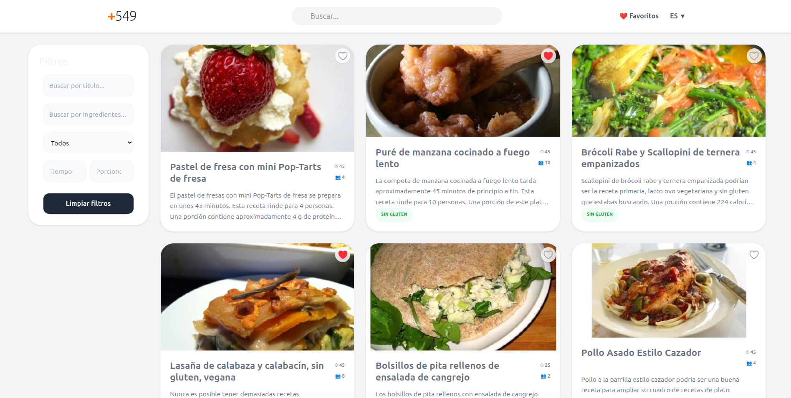
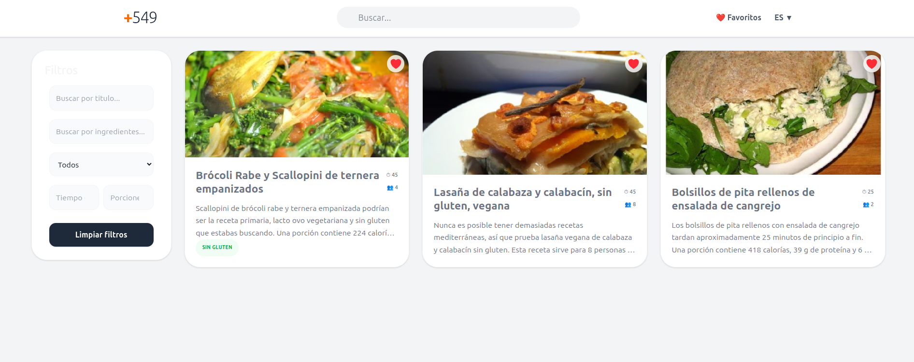
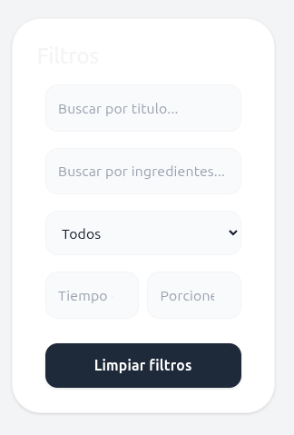

# Recetario Web - Grupo +549 

Este proyecto es una aplicación web de recetas desarrollada para la cátedra de **Programación Web Avanzada**. La plataforma permite explorar platos, filtrar por categorías y gestionar una lista de favoritos personalizada.

## Tecnologías Utilizadas

*   **React** - Biblioteca base para la interfaz.
*   **Tailwind CSS** - Framework para el diseño y estilos.
*   **Vite** - Herramienta de construcción y desarrollo.
*   **React Router** - Gestión de navegación entre páginas.
*   **Vercel** - Hosting y despliegue.

## Características Principales

*   **Multilenguaje:** La aplicación cuenta con soporte para dos idiomas.
*   **Navegación:** Páginas dedicadas para el **Home**, **Favoritos** y **Detalles** de cada receta.
*   **Interactividad:** Filtros de búsqueda avanzados y scroll infinito para una mejor experiencia de usuario.

---

## Capturas de Pantalla

### Home

### Favoritos

### Filtros de Búsqueda

---

## Cómo ejecutar el proyecto

Puedes ver la versión en vivo aquí: [https://pwa-549.vercel.app/](https://pwa-549.vercel.app/)

Si deseas ejecutarlo de forma local, sigue estas instrucciones:

1. **Clonar el repositorio:**
   git clone [https://github.com/HNS5639/pwa_549/](https://github.com/HNS5639/pwa_549/)
2. **Instalar las dependencias:**
   npm install
3. **Ejecutar el proyecto en entorno de desarrollo:**
   npm run dev